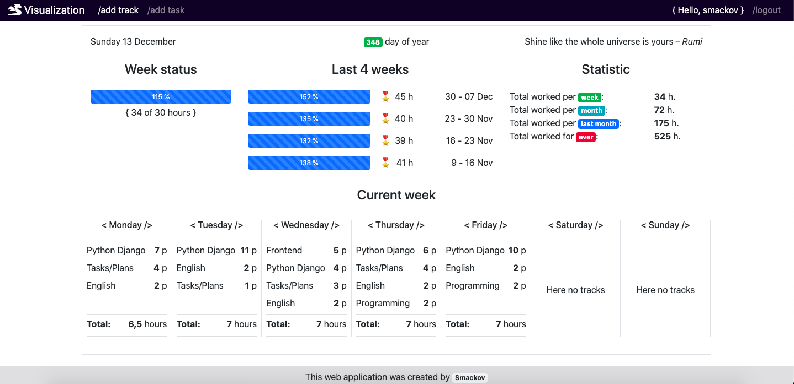
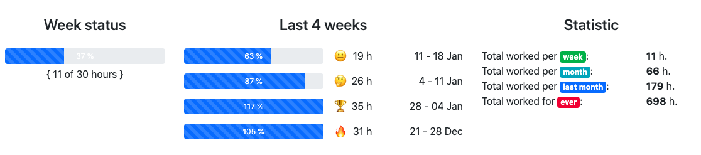

# The "Visualization" site

Visualization - the site for tracking your productivity. It's a good tool to visual your work time.
Beneath you can see screen from index page of the site. It's dashboard showing your information about your work.

#### Reference to the site: [www.smackov.ru](http://www.smackov.ru/)
## Technologies used:

* ___Backend___: Python 3.8 / Django 3.x
* ___Frontend___: Bootstrap 4.5
* ___System___: nginx 1.8 / Supervisor / Ubuntu Server
* ___Server host___: Digital Ocean
* ___Database___: PostgreSQL

## Description

Данный сайт предназачен для записи и визуализации выполненных задач (task). Вы можете создать задачу (task), например, 'English'. Работая над задачей и выделяя на нее время, вы можете записывать потраченное время в собственный профиль, чтобы видеть сколько времени вы тратите на выполнение данной задачи, и когда вы это делали. Поработав над задачей 1 час (или 2 помидорки по 25-30 минут) вы создаете трек (track), который о говорит о том, что Вы в определенный день занимались определенной задачей определенное количество времени с определенным результатом (rate).

## Dashboard at index page

The dashboard can show you how many time you have spent for work. Beneath you can sea part of this board:

This paned contains 3 parts:
* _Week status_ - it shows how many time we have been working in current week. At this example we have 11 hours of 30 hours that we planned to work.
* _Last 4 weeks_ - it shows how many time we worked in last 4 week, excluding current week. It's a good overview to look our
